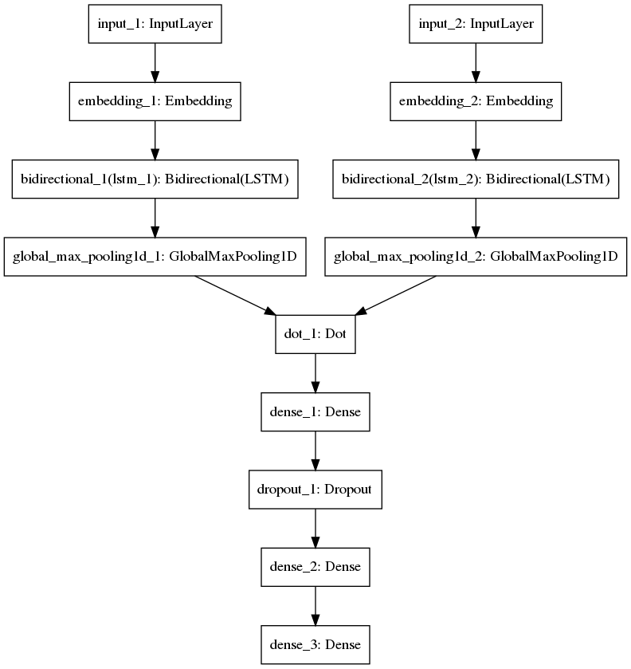

# NLP Tasks

This is a compilation of natural language processing tasks such as sentence similarity, named entity recognition, e.t.c

## Data Sources

### Sentence Similarity

Get the [data](https://www.kaggle.com/quora/question-pairs-dataset), extract and store in `data/sentsim/questions.csv`

- `sentsim/wnn.py` makes use of a wide neural network to provide a sigmoid value of sentence similarity
The architecture used is shown below



To make use of it, pass both sentences to the script (NOTE: current threshold is 0.5)

```bash
python sentsim/wnn.py "I am not very sad" "I am normal" 
```

- `sentsim/doc2vec.py` makes use of a word2vec extension for paragraph, document similarity known as [doc2vec](https://www.quora.com/What-is-doc2vec?share=1)


### Named Entity Recognition

Get the [data](https://gmb.let.rug.nl/releases/gmb-2.2.0.zip) and store it as a folder `gmb-2.2.0/` under `data/ner/`
